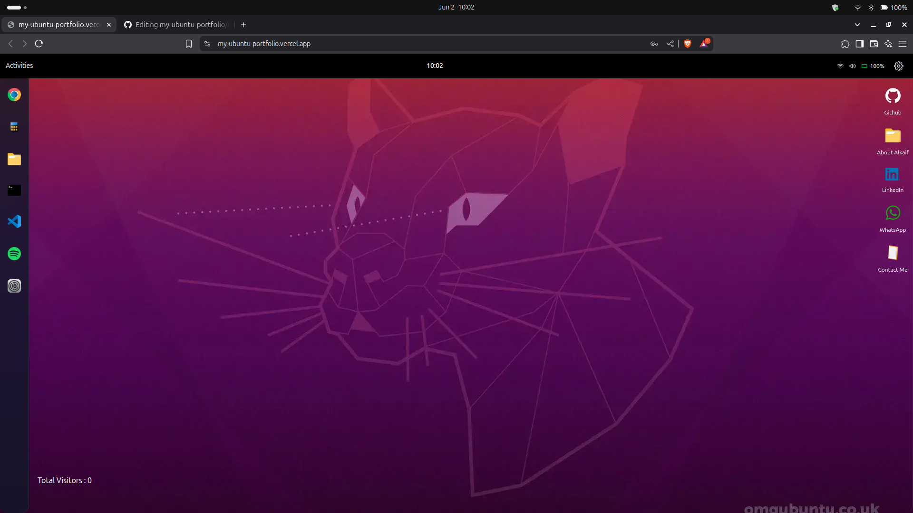

# 🍎 macOS-Style Portfolio [](https://github.com/yourusername/yourrepo)



A sleek, interactive portfolio inspired by macOS with draggable windows, a dock, and realistic UI interactions. Built with Next.js, TypeScript, and Tailwind CSS.

## ✨ Features

- 🖥️ **macOS-like Desktop Experience**  
  - Draggable, resizable windows  
  - Minimize/maximize animations  
  - System-style dock with hover effects  

- 🎨 **Visual Design**  
  - Dark/light mode toggle  
  - Smooth animations with Framer Motion  
  - Pixel-perfect UI elements  

- ⚡ **Performance**  
  - Next.js optimized builds  
  - Lazy-loaded components  
  - 90+ Lighthouse score  

## 🛠 Tech Stack

**Frontend**  
- Next.js 14 (App Router)  
- TypeScript  
- Tailwind CSS  
- Framer Motion (Animations)  
- Zustand (State Management)  

**Backend**  
- Prisma ORM  
- SQLite (Built-in database)  
- Visitor analytics tracking  

## 🚀 Quick Start

1. **Clone the repository**  
   ```bash
   git clone https://github.com/ghosttrozan/my-ubuntu-portfolio.git
   cd my-ubuntu-portfolio
